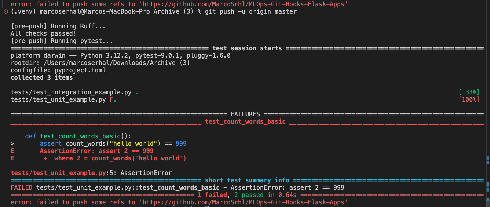
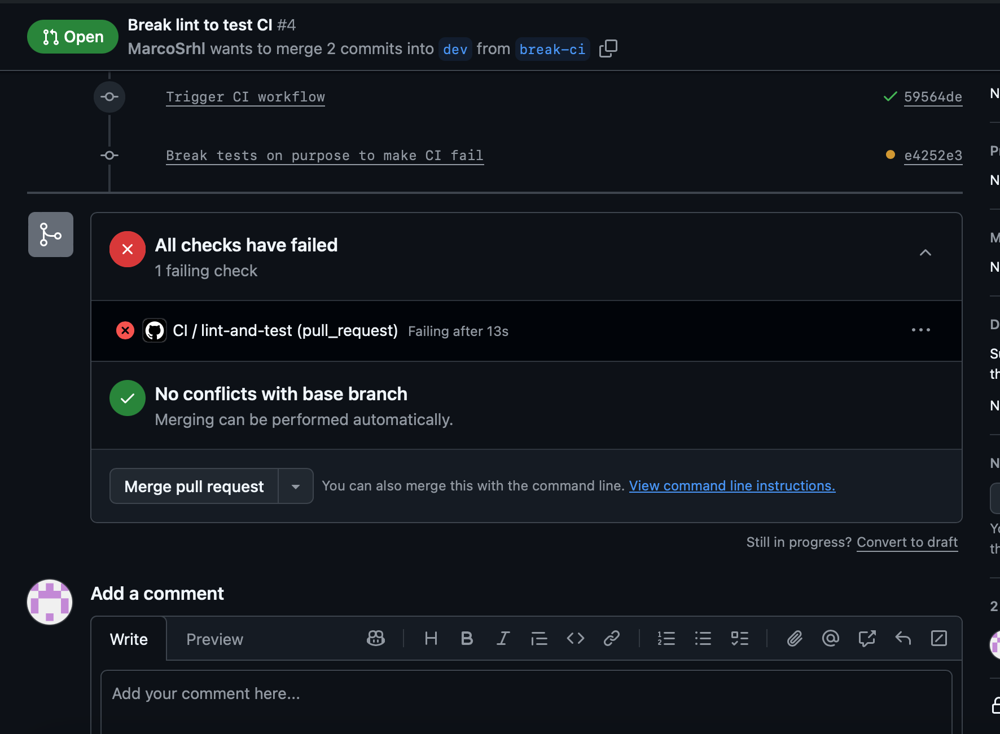
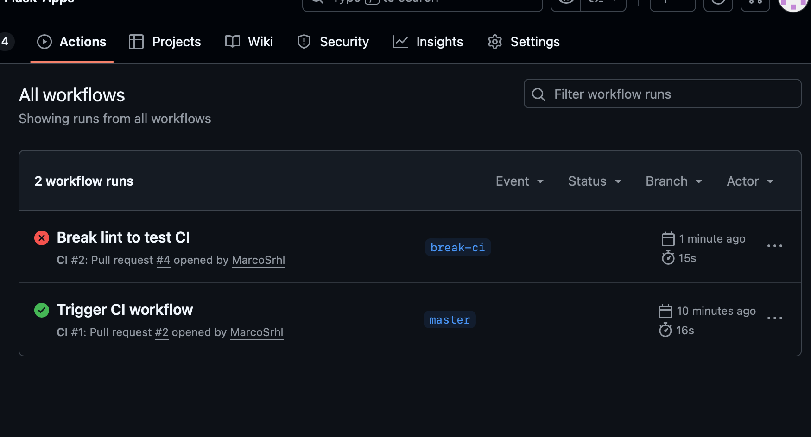

# MLOps Git Hooks & Flask App

This project demonstrates how to combine a simple Flask application with automated quality controls using Git Hooks, Ruff linting, Pytest, and GitHub Actions CI.

## Features
- Flask App

Located in app.py, the app allows users to:

View, add, update, and delete items

Render a simple HTML interface (templates/index.html)

Store data in-memory (items = [])

- Unit & Integration Tests

Located in tests/:

test_unit_example.py → tests the pure function count_words()

test_integration_example.py → tests the / endpoint with Flask’s test client

Run locally with:

pytest

- Ruff Linting

Configured in pyproject.toml
Run locally:

ruff check .

- Git Pre-Push Hook

Located in .git/hooks/pre-push
Runs automatically on git push:

Ruff linting

Pytest tests

If either fails -> the push is blocked.

Bypass (used only for demonstration):

git push --no-verify

- GitHub Actions CI

Workflow file: .github/workflows/ci.yml
Runs automatically on Pull Requests targeting dev:

Installs dependencies

Runs Ruff

Runs Pytest
Fails if linting or tests fail.

# MLOps – Linting, Testing & Git Hooks for a Flask App

This project implements a simple Flask application and adds basic MLOps practices around linting, testing, and CI/CD.

## 1. Flask Application
A small Flask app was created with the following features:
- View items
- Add an item
- Delete an item
- Update an item

All data is stored in an in-memory list.

## 2. Linting (Ruff)
Ruff is used to check code style and formatting.  
The configuration is defined in `pyproject.toml`.

## 3. Testing (Pytest)
Two kinds of tests were added under the `tests/` directory:
- **Unit test** for a pure helper function
- **Integration tests** using Flask’s test client

## 4. Local Git Hook
A `pre-push` hook was added under `.git/hooks/` to automatically run:
- `ruff check .`
- `pytest`

The push is blocked if either step fails.

## 5. GitHub CI
A GitHub Actions workflow (`.github/workflows/ci.yml`) was added.  
It runs Ruff and Pytest automatically for pull requests targeting the `dev` branch.  
The PR fails if linting or tests fail.

## Images

### Local Git Hook

After setting back assert count_words("hello world") == 2 in our test_unit it works

### Local Git Hook Sucess

### GitHub CI (success)

We create a branch to make the CI fail, we need to by-pass the pre-push hook we have so needed to push with git push --no-verify -u origin break-ci
### GitHub CI (failure)

### Github Actions

